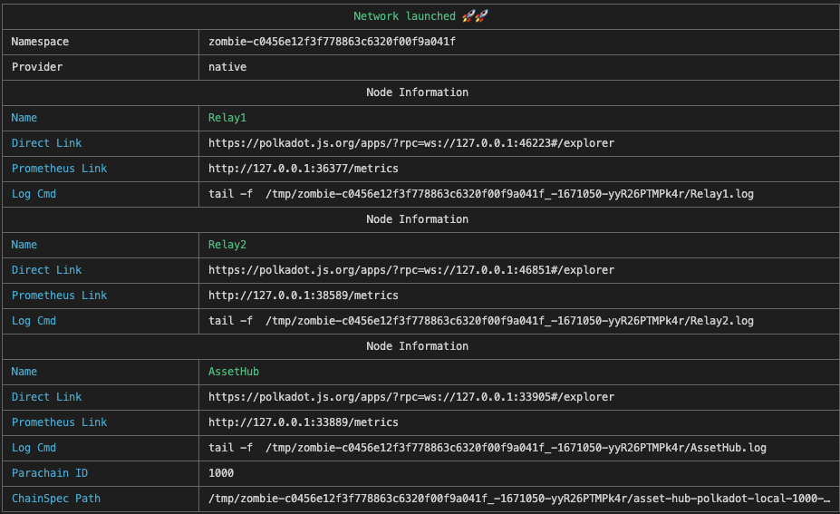
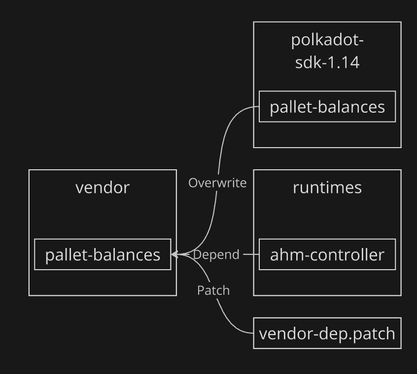
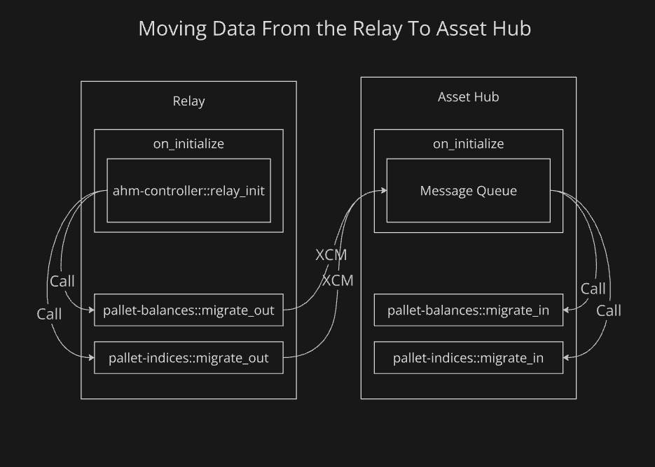

## Dependencies

- [just](https://github.com/casey/just) for command running `cargo install just`.
- [zombienet](https://github.com/paritytech/zombienet/releases/) binary in your path.

## Usage

Setup, build and start the testnet with:

```sh
just
```

You should see this, wich clickable links for each network:


It should also emit a lot of events for processed and enqueued messages.

## Findings

Things that came up and need adressing:
- DMP delivery fee increases once the relay starts spamming
- AH can silently ignore messages if they are too big. Need to safeguard against this on the relay side already.

## Known Issues

The test setup is quite convoluted, due to two missing dependencies:
- [ZombieBite](https://github.com/pepoviola/zombie-bite): This would allow to easily fork the network with live state.
- [Runtime stable2409](https://github.com/polkadot-fellows/runtimes/pull/490): This would hopefully make it possible to build the runtime without all the current hacks.

This results in two short-comings:
- The AssetHub initial state is empty. Therefore not having realistic PoV on the parachain side.
- The build-setup is complicated and relies on scripts to patchup and copy files - just to make cargo happy.

## Structure

This results in the following structure after running the `just` command:
- `justfile`: Central manager script with sub-commands
	- (no cmd): Setup, build and spawn the network.
	- `build`: Build the code.
	- `spawn`: Spawn the network without building.
- `runtimes`: Runtimes Polkadot runtimes from the 1.3.3 release.
- `polkadot-sdk-1.14`: Local development folder for editing SDK pallet. If you need to modify a pallet, do it there. Branch is `oty-ahm-controller`.
- `polkadot-sdk`: Don't modify this. Just used to build the nodes.
- `vendor`: The dependencies that the runtime builds against.

The code in the `runtimes` directory relies on `crates-io.patch` entries in its `Cargo.toml` file to use the dependencies from the `vendor` directory instead of from `crates.io` directly. This is needed to allow us to build against modified versions of the dependencies. The preferred way of doing this - using the 1.14 branch of the SDK - does not work here, since that branch is out of sync with `crates.io`.

This means that any modification a developer does to a pallet, for example in `polkadot-sdk-1.14/substrate/frame/balances`, will be copied by the `justfile` to the `vendor` directory. This works fine for normal code changes, but for changes to the `Cargo.toml`, it neccecitates an entry in `vendor-dep.patch`. This patch will always be applied before building.

Hopefully this graph helps to understand the relation:



## Strategy

The overall migration is coordinated by the `ahm-controller` pallet that is deployed on both Relay and AH. The controller pallet calls into each pallet one-by-one and ensures that they finish their migration.

The linear data-flow looks like this:
`Relay on_init` -> `ahm-controller::relay_init` -> `pallet-balances::migrate_out` -> `XMCP` -> `Ah on_init` -> `message_queue::process` -> `pallet-balances::migrate_in `.

And in graphical form:



## Account Migration

### With Sufficients

This strategy uses sufficient refs to ensure that no account will be dusted on either side and both exist during the time of operation.  
We need to be careful to not mess up references that other pallet have placed, but the only pallet using this kind is the `assets` pallet, which can easily be reviewed for conflicts.

Accounts will be migrated in the following way:
1. A pallet wants to migrate a specific freeze, lock, reserve or hold. Otherwise nothing happens for that account (as of yet).
2. The Relay places a *sufficient* reference on the account.
3. The Relay puts the information that a sufficient was placed into storage.
4. The Relay unlocks/unreserves the balance and teleports it over.
5. The AH palaces a *sufficient* reference on the account.
6. The AH puts the information that a sufficient was placed into storage.
7. The AH locks/reserves/freezes/holds the balance that was teleported.
8. At the end of the migration, both Relay and AH cleanup the sufficient refs.

### Just ED

Another way would be to force-teleport the ED of 0.01 DOT to AH for all affected accounts.

Originally I thought this to be a good idea, but some reasons not todo it:
- Has to sometimes mint the ED, in case that accounts have between 1 and 1.01 DOT balance without a reserve or lock.
- Would affect system accounts and possibly violate some of their invariants.
